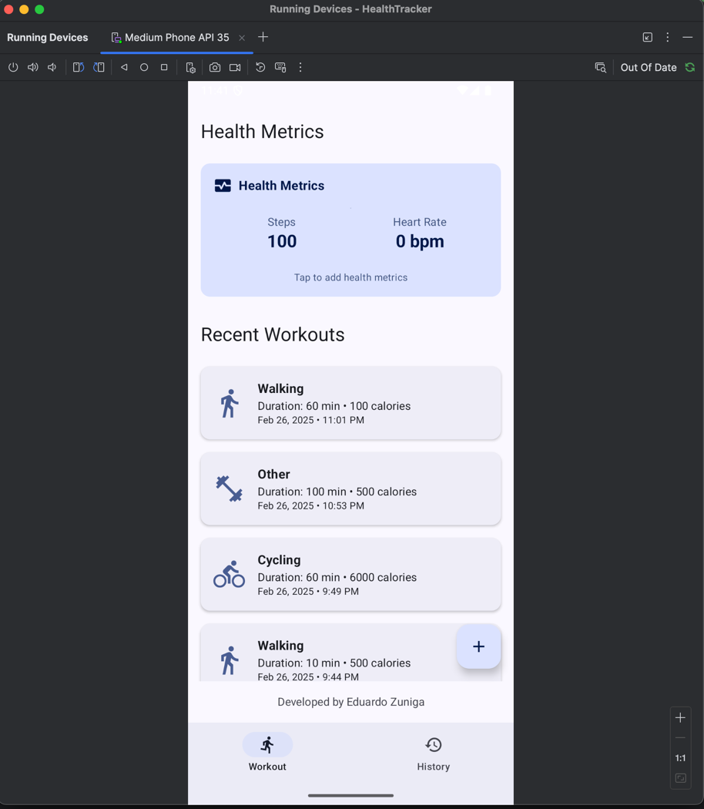
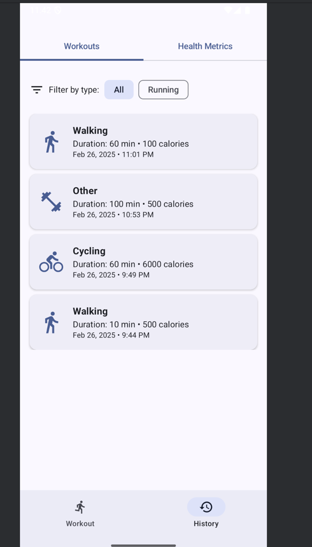
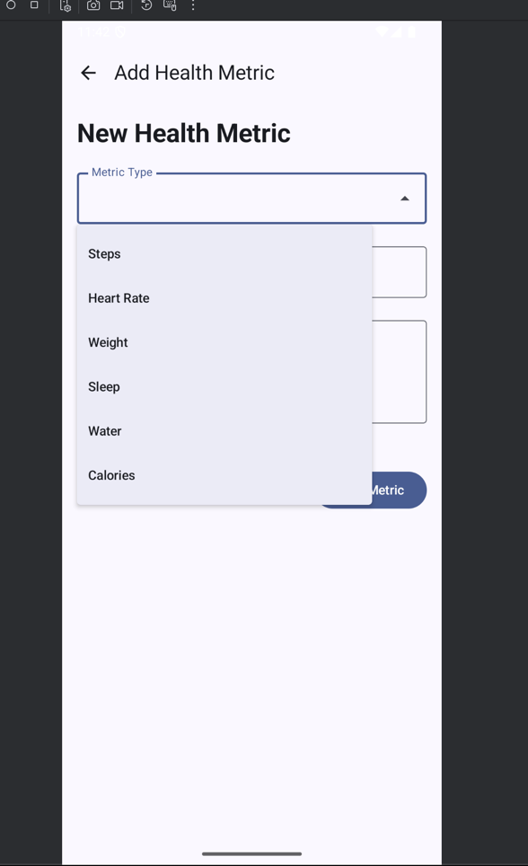

# Health Tracker

A modern Android application for tracking workouts and health metrics, built with Jetpack Compose and Material 3 design.


## Features

- **Workout Tracking**: Log various workout types including running, cycling, swimming, yoga, weightlifting, HIIT, walking, and hiking
- **Health Metrics**: Record and monitor health measurements like heart rate, blood pressure, weight, etc.
- **History View**: View your workout and health data history with filtering options
- **Material Design**: Modern UI with Material 3 components and theming
- **Offline-First**: All data stored locally on your device

## Tech Stack

- **Kotlin 2.0+**: Modern, concise programming language for Android
- **Jetpack Compose**: Declarative UI toolkit for building native Android UI
- **Material 3**: Latest Material Design components and theming
- **Room Database**: SQLite abstraction layer for local data persistence
- **Kotlin Coroutines & Flow**: For asynchronous programming and reactive streams
- **MVVM Architecture**: Clean separation of UI, business logic, and data
- **Navigation Compose**: Type-safe navigation between screens
- **Splash Screen API**: Modern splash screen implementation

## Architecture

The app follows MVVM (Model-View-ViewModel) architecture with Repository pattern:

- **Data Layer**: Room database with entities, DAOs, and repositories
- **Domain Layer**: ViewModels that handle business logic and state management
- **UI Layer**: Compose screens and components that display data and handle user interactions

## Screenshots

|         Workout Screen          |          History Screen           |          Add Workout           |
|:-------------------------------:|:---------------------------------:|:------------------------------:|
|  |  | ! |

## Getting Started

### Prerequisites

- Android Studio Iguana or newer
- Minimum SDK 24 (Android 7.0)
- Target SDK 35

### Installation

1. Clone the repository:
```bash
git clone https://github.com/yourusername/health-tracker.git
```

2. Open the project in Android Studio

3. Build and run the app on an emulator or physical device

## Project Structure

```
app/
├── src/
│   ├── main/
│   │   ├── java/com/example/healthtracker/
│   │   │   ├── data/
│   │   │   │   ├── dao/
│   │   │   │   ├── entity/
│   │   │   │   └── repository/
│   │   │   ├── ui/
│   │   │   │   ├── components/
│   │   │   │   ├── navigation/
│   │   │   │   ├── screens/
│   │   │   │   ├── theme/
│   │   │   │   └── viewmodel/
│   │   │   └── MainActivity.kt
│   │   └── res/
│   └── test/
└── build.gradle.kts
```

## Key Components

- **Entities**: `Workout` and `HealthMetric` define the database structure
- **DAOs**: Provide methods for accessing and manipulating data
- **Repositories**: Abstract data sources and provide clean APIs to ViewModels
- **ViewModels**: Manage UI state and business logic
- **Screens**: Compose functions that define the UI for different screens
- **Navigation**: Handles routing between screens with type-safe arguments

## Future Enhancements

- Cloud synchronization
- Workout analytics and trends
- Goal setting and progress tracking
- Social sharing features
- Integration with wearable devices

## Contributing

Contributions are welcome! Please feel free to submit a Pull Request.

1. Fork the repository
2. Create your feature branch (`git checkout -b feature/amazing-feature`)
3. Commit your changes (`git commit -m 'Add some amazing feature'`)
4. Push to the branch (`git push origin feature/amazing-feature`)
5. Open a Pull Request

## License

This project is licensed under the MIT License - see the LICENSE file for details.

## Acknowledgments

- Material Design guidelines and components
- Jetpack Compose documentation and codelabs
- Room persistence library documentation

---

Developed by Eduardo Zuniga
